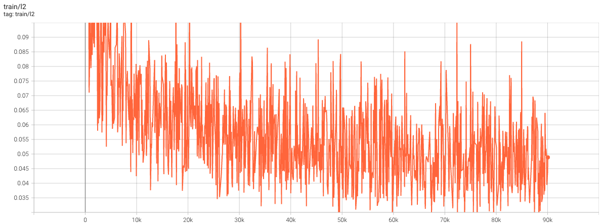
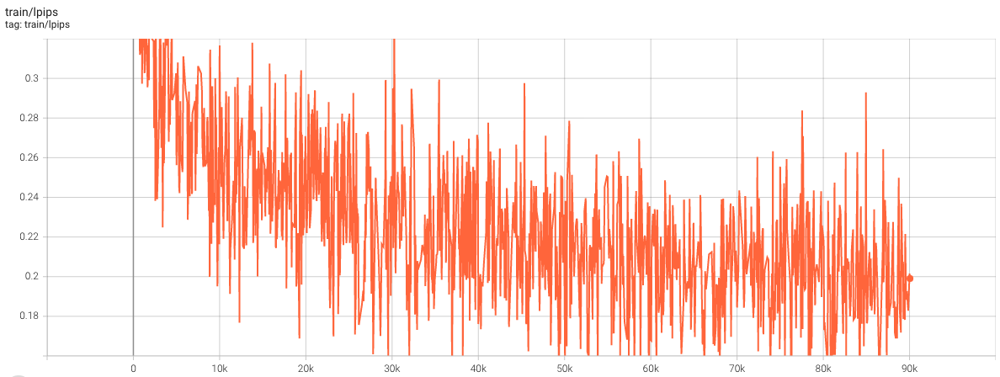
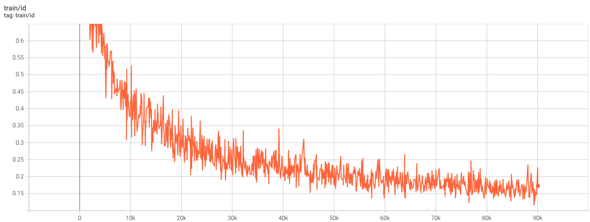
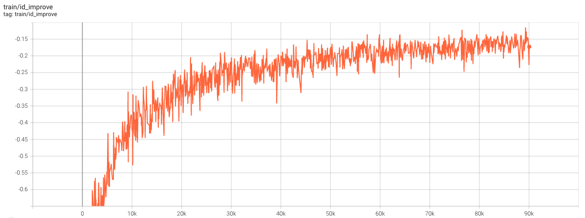
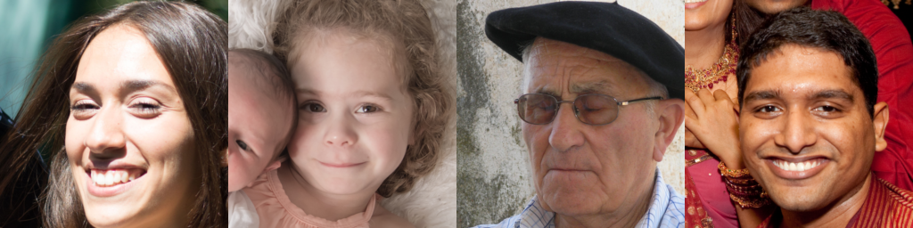
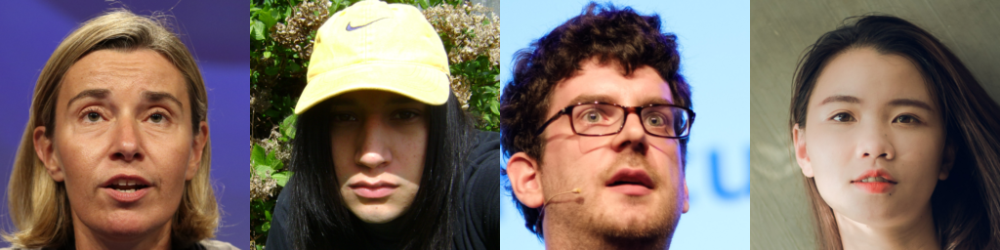
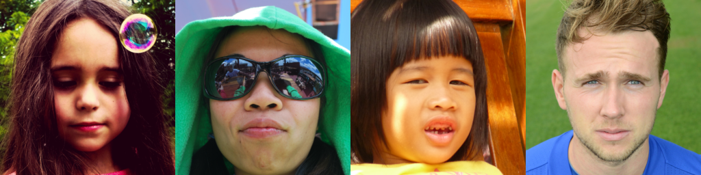
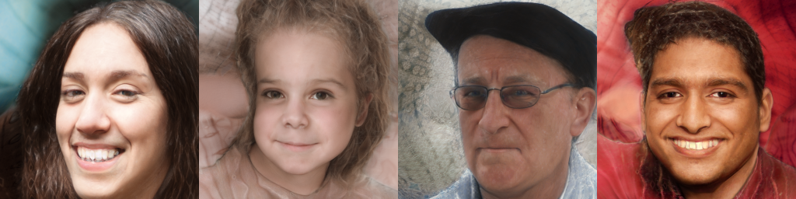
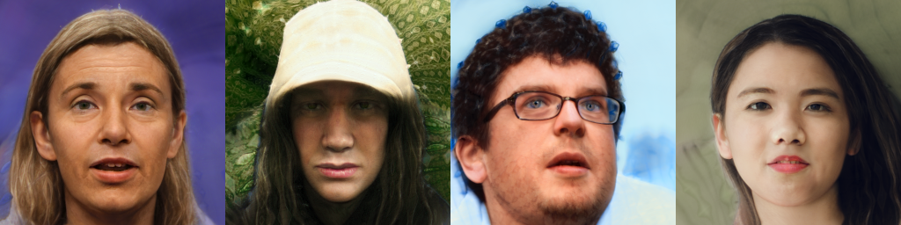
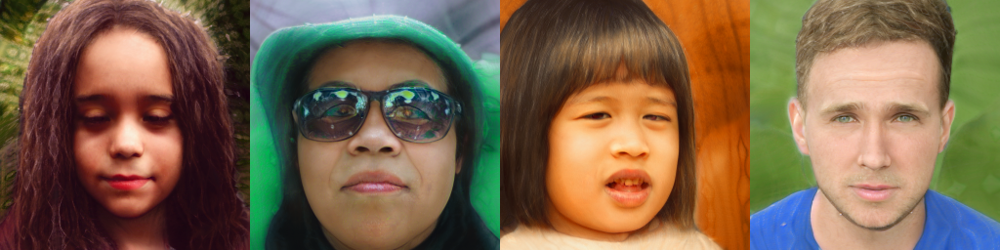

# stylegan3-encoder

## Introduction
Encoder implementation for image inversion task of stylegan3 generator ([Alias Free GAN](https://github.com/NVlabs/stylegan3)).  
The neural network architecture and hyper-parameter settings of the base configuration is almost the same as that of [pixel2style2pixel](https://github.com/eladrich/pixel2style2pixel), and various settings of improved encoder architecture will be added in the future.  
For fast training, pytorch DistibutedDataParallel is used.  

## Installation

### GPU and NVIDIA driver info
* GeForce RTX 3090 x 8
* NVIDIA driver version: 460.91.03

### Docker build
```
$ sh build_img.sh
$ sh build_container.sh [container-name]
```

### Install package
```
$ docker start [container-name]
$ docker attach [container-name]
$ pip install -v -e .
```

### Train
```
python train.py \
    --outdir exp/[exp_name] \
    --encoder [encoder_type] \
    --data data/[dataset_name] \
    --gpus [num_gpus] \
    --batch [total_batch_size] \
    --generator [generator_pkl]
```

## Experiments
### Base configuration
**Train options**
```
{
  "model_architecture": "base",
  "dataset_dir": "data/ffhq",
  "num_gpus": 8,
  "batch_size": 32,
  "batch_gpu": 4,
  "generator_pkl": "pretrained/stylegan3-t-ffhq-1024x1024.pkl",
  "training_steps": 90001,
  "val_steps": 5000,
  "print_steps": 50,
  "tensorboard_steps": 50,
  "image_snapshot_steps": 100,
  "network_snapshot_steps": 1000,
  "learning_rate": 0.001,
  "l2_lambda": 1.0,
  "lpips_lambda": 0.8,
  "id_lambda": 0.1,
  "reg_lambda": 0.0,
  "gan_lambda": 0.0,
  "edit_lambda": 0.0,
  "random_seed": 0,
  "num_workers": 3,
  "resume_pkl": null,
  "run_dir": "exp/base/00000-base-ffhq-gpus8-batch32"
}

```
**Learning Curve**





**Trainset examples**  
Real image batch X



Encoded image batch G.synthesis(E(X))




**Encoder checkpoint**  
will be available in few days

## TODO
 - [x] Refactoring configuration system
 - [x] Implement resume checkpoint
 - [ ] Implement scripts for Validation, test dataset
 - [ ] Implement demo script
 - [ ] Train encoder for stylegan3-r generator
 - [ ] Model architecture over parametrization using [Transformer](https://arxiv.org/abs/1706.03762)
 - [ ] Apply L2 delta-regularization loss and GAN loss(latent discriminator), [e4e](https://arxiv.org/abs/2102.02766)
 - [ ] Apply [hyperstyle](https://github.com/yuval-alaluf/hyperstyle)

## References
1. [stylegan3](https://github.com/NVlabs/stylegan3)
2. [pixel2style2pixel](https://github.com/eladrich/pixel2style2pixel)
